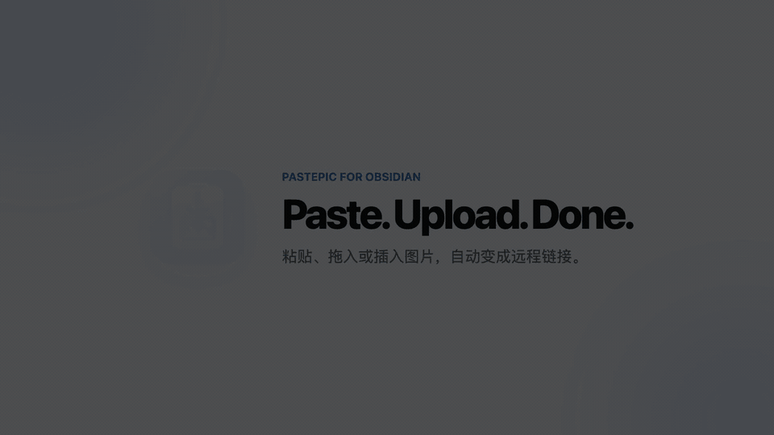
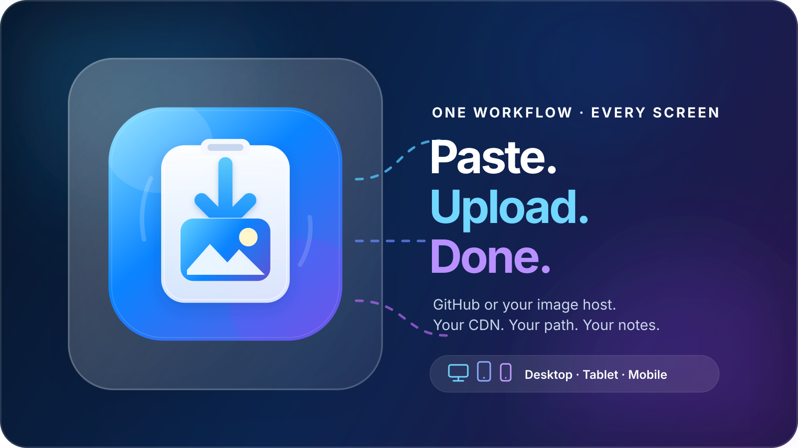

<p align="center">
  
</p>

<p align="center">
  <a href="https://github.com/zengyincen/Obsidian-PastePic/releases/latest"></a>
  <a href="https://github.com/zengyincen/Obsidian-PastePic/releases"></a>
  <a href="https://github.com/zengyincen/Obsidian-PastePic/stargazers"></a>
  <a href="https://github.com/zengyincen/Obsidian-PastePic/commits/main"></a>
  <a href="https://github.com/zengyincen/Obsidian-PastePic/issues"></a>
  <a href="./LICENSE"></a>
</p>

<p align="center">
  <strong>One plugin. Every screen.</strong><br />
  Pastepic brings the same automatic image-upload workflow to Obsidian on desktop, tablet, and mobile.
</p>

<p align="center">
  <a href="https://community.obsidian.md/plugins/obsipastepic"><strong>Install in Obsidian</strong></a>
  ·
  <a href="#three-minute-github-setup"><strong>3-minute setup</strong></a>
  ·
  <a href="#cdn--proxy-base-directory"><strong>CDN path</strong></a>
  ·
  <a href="./README_ZH.md">简体中文</a>
  ·
  <strong>English</strong>
</p>

<p align="center">
  
</p>

## 36-second real demo

<p align="center">
  <a href="./assets/pastepic-demo.mp4"></a>
</p>

Paste an image once; Pastepic uploads it, replaces the placeholder with a standard remote Markdown image link, and keeps the note usable if an upload fails. The desktop segment above is a **real capture from Obsidian 1.12.7** using the published plugin workflow. [Watch the sharper 1080p MP4](./assets/pastepic-demo.mp4).

The tablet and phone cards describe verified compatibility paths—not simulated device footage. Mobile support is backed by the same browser-safe uploader code, `clipboardData.items` fallback tests, `isDesktopOnly: false`, and an Obsidian 1.12.4 minimum version. Real device clips can be added separately without presenting a mockup as proof.

## Why Pastepic?

Screenshots, web images, and design exports can make an Obsidian vault grow quickly. Manually opening an image host, uploading, copying a URL, and returning to the note also breaks the writing flow.

<p align="center">
  
</p>

Pastepic does one thing well: **it catches an image that is pasted, dropped, or newly inserted as a local Obsidian link, uploads it, and puts the remote Markdown image link back in the same place.** Every upload gets a unique placeholder. A failed upload restores the local image link instead of leaving a broken error link.

**Desktop, tablet, or phone—the workflow stays the same.** Configure Pastepic once in your synced vault and keep the same GitHub or image-host destination, CDN path, and paste-to-upload experience on every screen.

## Features

| Capability | Details |
| --- | --- |
| Automatic paste upload | Paste multiple images and replace each independent placeholder asynchronously |
| Drag-and-drop upload | Optionally upload images dropped into the Markdown editor |
| Inserted-image detection | Upload local image links newly inserted by Obsidian or another plugin |
| GitHub image hosting | GitHub Contents API with branches, date paths, and commit-message templates |
| Generic image-host API | `POST multipart/form-data` with custom headers, file field, and extra form fields |
| CDN / proxy acceleration | Enter an image-directory base URL; the plugin appends the filename and extension |
| Multilingual settings | Simplified Chinese, English, Japanese, Korean, Italian, Spanish, German, and French |
| Native fallback | Leaves Obsidian untouched when there is no image, mixed file types, or missing configuration |
| Every screen | One image workflow across desktop, tablet, and mobile Obsidian |
| Mobile-ready paste | Clipboard-items fallback for iOS, Android, and mobile WebViews |

## Installation

### Install from the Obsidian community directory — recommended

1. In Obsidian, open **Settings → Community plugins**.
2. Choose **Browse**, search for **Pastepic**, and open it.
3. Choose **Install**, then **Enable**.

You can also open the listing directly: **[Install Pastepic in Obsidian](obsidian://show-plugin?id=obsipastepic)**.

> Pastepic is listed in the official [Obsidian plugin directory](https://obsidian.md/plugins?id=obsipastepic). Version 0.4.15 supports Obsidian Mobile 1.12.4 and Desktop 1.12.7 or later.

### Manual installation from a Release

1. Open the [latest Release](https://github.com/zengyincen/Obsidian-PastePic/releases/latest).
2. Download `main.js`, `manifest.json`, and `styles.css`.
3. Create the plugin directory in your vault:

   ```text
   <your-vault>/.obsidian/plugins/obsipastepic/
   ```

4. Put the three downloaded files in that directory. The color icon is bundled into `main.js`, so no additional asset file is required.
5. Restart Obsidian and enable **Pastepic** under Settings → Community plugins.

> The user-facing name is **Pastepic**. The plugin ID and installation directory remain `obsipastepic` to preserve existing installations and settings.

### Build from source

```bash
git clone https://github.com/zengyincen/Obsidian-PastePic.git
cd Obsidian-PastePic
npm install
npm test
npm run build
```

## Three-minute GitHub setup

Pastepic's settings page now treats only three values as required. The branch defaults to `main`; repository path and CDN can stay empty.

1. Use **Create image repository** in Pastepic settings, or select an existing public repository.
2. Use **Create least-privilege token** and create a **fine-grained personal access token**:
   - Limit repository access to the image repository;
   - Set Repository permissions → Contents to **Read and write**;
   - Grant no unrelated permissions.
3. Enter only **Repository owner**, **Repository**, and **GitHub Token**.
4. Run **Test GitHub configuration**, then paste an image.

| Required now | Already handled for you |
| --- | --- |
| GitHub owner | Branch defaults to `main` |
| Image repository | Repository path defaults to empty/root |
| Fine-grained token | CDN defaults to GitHub Raw |

Open **Advanced options (skip for now)** only when you need another branch, a fixed repository folder, custom filenames, or CDN acceleration. **Use jsDelivr** fills the CDN base directory automatically from the current owner, repository, branch, and path.

### Paths and filenames

The repository path is empty by default, so images are uploaded to the repository root. You can instead enter a fixed directory such as `images`; when using a custom CDN, point its base URL to the same directory.

The settings page defaults to Simplified Chinese and can be switched to English, Japanese, Korean, Italian, Spanish, German, or French at any time.

### Cross-platform support and evidence

Pastepic supports Obsidian across desktop computers, tablets, and phones, including iOS and Android. Pasting an image from the system clipboard uploads it through the configured GitHub repository or image host, including mobile WebViews that expose the image through clipboard items instead of a file list. Mobile operating systems do not provide the same drag-and-drop interaction as desktop, so use paste or insert the image into the note; the optional drop setting remains available for platforms that provide drop events.

| Platform | Supported workflow | Current evidence |
| --- | --- | --- |
| Desktop | Paste, drop, and inserted local image | Real Obsidian 1.12.7 capture in the demo above |
| Tablet | Paste and inserted local image; drop where the OS provides it | Browser-safe runtime plus mobile clipboard-item fallback tests |
| Phone | Paste and inserted local image | Browser-safe runtime plus mobile clipboard-item fallback tests |

Pastepic uses no Electron or Node runtime APIs and declares `isDesktopOnly: false`. The test suite covers mobile WebViews that expose pasted images through `DataTransfer.items`. Device-specific clipboard behavior can still vary by OS/app source; please include the device, OS, Obsidian version, and source app in a [mobile compatibility report](https://github.com/zengyincen/Obsidian-PastePic/issues/new).

Filename strategies:

- Timestamp + original filename — default and least likely to collide;
- Timestamp only;
- Original filename.

The default commit message is `Upload from Pastepic`. Custom messages can also use `{filename}` and `{path}`.

## CDN / proxy base directory

There are no template variables. Enter the URL of the **final image directory** and Pastepic appends the uploaded filename and extension automatically.

For a repository directory named `images` and an uploaded filename `1730000000-note.png`:

| Use case | Base directory in settings | Final URL |
| --- | --- | --- |
| GitHub Raw | Leave empty | A complete Raw URL is generated automatically |
| jsDelivr | `https://cdn.jsdelivr.net/gh/zengyincen/image-bed@main/images/` | `…/images/1730000000-note.png` |
| Statically | `https://cdn.statically.io/gh/zengyincen/image-bed/main/images/` | `…/images/1730000000-note.png` |
| Custom proxy/CDN | `https://cdn.example.com/xx/xx/` | `https://cdn.example.com/xx/xx/1730000000-note.png` |

The settings screen displays the complete URL preview. A custom base must point to the same directory as “Repository path.”

> Raw and public CDN links generally cannot read private GitHub repositories anonymously. Uploads may succeed while images remain unavailable. Use an authenticated proxy or a public image repository.

## Custom image-host API

Custom mode sends images as `POST multipart/form-data`:

```http
POST /upload
Content-Type: multipart/form-data

file=<image bytes>
album=obsidian
```

| Setting | Example |
| --- | --- |
| Endpoint | `https://img.example.com/upload` |
| File field | `file`, `image`, or `source` |
| Header JSON | `{"Authorization":"Bearer token"}` |
| Extra field JSON | `{"album":"obsidian"}` |
| Response URL path | `data.url` or `data.images[0].url` |
| CDN / proxy base directory | `https://cdn.example.com/xx/xx/`; leave empty to use the host response URL |

Services that require custom signatures, chunked uploads, or an interactive browser login need a dedicated uploader implementation.

## Paste behavior and failures

- The plugin does nothing when the clipboard contains no image.
- It does not intercept a mixed list of image and non-image files.
- Missing configuration preserves Obsidian's native paste behavior.
- Uploads start with a unique placeholder and finish as standard `` Markdown, without `< >` around the URL.
- Failed uploads restore the local image link instead of creating `[Github upload error]()` or an HTML error comment.
- Existing legacy `[Github upload error]()` markers are removed automatically on editor changes.
- A setting controls whether images are uploaded when clipboard text is present too.

## Security

- The GitHub token is stored as plain text in the plugin's `data.json`. Use a **single-repository, least-privilege, revocable** token.
- Never expose tokens or custom authorization headers in screenshots, Issues, logs, or public notes.
- GitHub and public CDNs have terms and traffic limits. Normal personal-note images are usually fine; they are not unlimited object storage.

## Development and verification

```bash
npm run typecheck   # TypeScript type checking
npm test            # Vitest unit tests
npm run build       # Build main.js
```

Tests cover base-directory joining, angle-bracket-free Markdown, path encoding, file naming, local image insertion detection, legacy error-marker cleanup, JSON response paths, and settings migration.

## Brand assets

| Asset | File | Intended use |
| --- | --- | --- |
| App Icon | [`assets/icon.svg`](./assets/icon.svg) | Avatar, app icon, compact identity |
| Banner | [`assets/banner.svg`](./assets/banner.svg) | Repository header and social banner |
| Hero | [`assets/hero.svg`](./assets/hero.svg) | README and product overview |

The visual system uses restrained gradients, layered glass, and generous spacing. It contains no Apple trademark or official Apple artwork.

## Acknowledgements

Pastepic is an independently implemented MIT-licensed project. The following projects provided valuable references for events, uploader abstractions, GitHub image hosting, and UX:

### Direct references

- [gavvvr/obsidian-imgur-plugin](https://github.com/gavvvr/obsidian-imgur-plugin) — image-paste events, uploader abstraction, and failure fallback.
- [yaleiyale/obsidian-emo-uploader](https://github.com/yaleiyale/obsidian-emo-uploader) — GitHub Contents API, multi-host settings, and CDN URL organization.
- [renmu123/obsidian-image-auto-upload-plugin](https://github.com/renmu123/obsidian-image-auto-upload-plugin) — paste placeholders, drag-and-drop uploads, and image-host workflows.

`obsidian-image-auto-upload-plugin` is a fork of `obsidian-imgur-plugin`; thanks to both maintainers for advancing this plugin family.

### Upstream projects and ecosystem credited by those references

- [jordanhandy/obsidian-cloudinary-uploader](https://github.com/jordanhandy/obsidian-cloudinary-uploader) — explicitly credited by Emo Uploader as a Cloudinary reference.
- [PicGo](https://github.com/Molunerfinn/PicGo) and [PicGo-Core](https://github.com/PicGo/PicGo-Core) — the image-host ecosystem and documentation used by Image Auto Upload Plugin.
- [GitHub REST API](https://docs.github.com/rest) and [jsDelivr](https://www.jsdelivr.com/) — upload and CDN infrastructure credited by Emo Uploader.
- [AList](https://github.com/AlistGo/alist), [EasyImages2.0](https://github.com/icret/EasyImages2.0), and [Chevereto](https://github.com/chevereto/chevereto) — self-hosted image ecosystems supported and credited by Emo Uploader.
- [Cloudinary](https://cloudinary.com/), [SM.MS](https://smms.app/), [ImgURL](https://www.imgurl.org/), [Imgur](https://imgur.com/), [imgbb](https://imgbb.com/), and [Catbox](https://catbox.moe/) — hosting services documented by the reference projects.
- Thanks also to [anxinJ](https://github.com/anxinJ) and [Linnnkkk](https://github.com/Linnnkkk), contributors explicitly named by Emo Uploader.

Thank you to [Obsidian](https://obsidian.md/) for the plugin API, and to every maintainer who publishes code and documentation openly.

## License

[MIT](./LICENSE) © 2026 zengyincen
